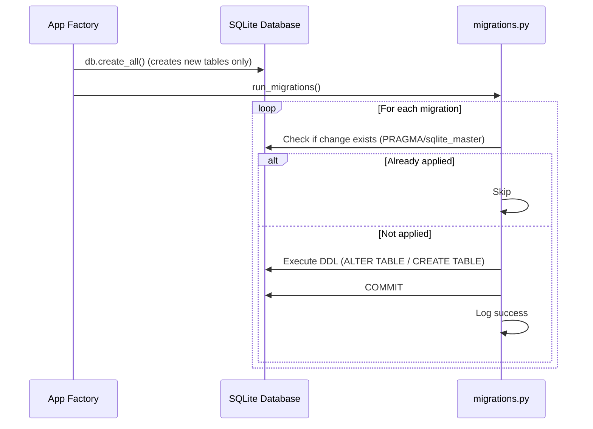

# ADR-006: Lightweight Schema Migrations

## Status

Accepted

## Date

2026-07-29

## Context

The application uses SQLite with `db.create_all()` to initialise the database on first run. This works for new deployments, but fails when schema changes are introduced on an existing production database:

- `db.create_all()` only creates **new tables** — it does not alter existing ones
- Adding a column (e.g. `ni_number` to `cases`) or a new table (e.g. `audit_logs`) requires explicit DDL statements against the existing database
- The production deployment uses a Docker named volume (`db_data`) that persists across container rebuilds

Options considered:

1. **Alembic** — full migration framework with revision tracking, auto-generation, and rollback support. Overkill for an MVP with a single SQLite database and infrequent schema changes.
2. **Manual SQL scripts** — error-prone, easy to forget, no idempotency guarantees.
3. **Drop and recreate** — unacceptable for production with real data.
4. **Lightweight startup migrations** — a simple Python module that checks what's missing and applies changes. Idempotent, zero dependencies, good enough for the MVP lifecycle.

## Decision

We implement a **lightweight migration runner** (`app/migrations.py`) that executes on every app startup, immediately after `db.create_all()`. Each migration:

1. **Checks** if the change has already been applied (column exists? table exists?)
2. **Applies** the DDL if not (ALTER TABLE, CREATE TABLE)
3. **Commits** the change

Migrations are registered as a list of functions in `run_migrations()`. They execute sequentially and are idempotent — safe to run any number of times.

### How it works



### Adding a new migration

1. Write a function in `app/migrations.py`:
   ```python
   def _add_new_column_to_cases():
       """Migration: Add some_column to cases table."""
       if _column_exists("cases", "some_column"):
           return
       logger.info("Applying migration: add some_column to cases")
       db.session.execute(
           db.text("ALTER TABLE cases ADD COLUMN some_column VARCHAR(100)")
       )
       db.session.commit()
   ```

2. Append it to the `migrations` list in `run_migrations()`:
   ```python
   migrations = [
       _add_ni_number_to_cases,
       _create_case_actions_table,
       _create_audit_logs_table,
       _add_new_column_to_cases,  # new
   ]
   ```

3. Deploy. The migration runs automatically on next startup.

## Consequences

- **No external tools required** — no Alembic, no CLI commands, no migration files to track
- **Zero-downtime deploys** — migrations run during app startup before traffic is served (gunicorn `--preload` ensures this happens once)
- **Append-only** — migrations are never removed or edited after deployment. New changes get new migration functions.
- **No rollback support** — if a migration fails, the app won't start. Fix forward by deploying a corrected migration.
- **SQLite-specific** — the DDL syntax (`PRAGMA table_info`, `ALTER TABLE ADD COLUMN`) is SQLite-specific. If/when we move to Postgres, this module should be replaced with Alembic.
- **Order matters** — migrations execute in list order. A migration that references a table must come after the migration that creates it.

## Current Migrations

| Function | What it does |
|----------|--------------|
| `_add_ni_number_to_cases` | Adds `ni_number VARCHAR(20)` column to `cases` table |
| `_create_case_actions_table` | Creates `case_actions` table (caseload actions checklist) |
| `_create_audit_logs_table` | Creates `audit_logs` table (change history) |

## Technical Details

### Files

- `app/migrations.py` — migration runner + individual migration functions
- `app/__init__.py` — calls `run_migrations()` after `db.create_all()` in the app factory

### Helper Functions

- `_column_exists(table, column)` — uses `PRAGMA table_info()` to check column presence
- `_table_exists(table)` — queries `sqlite_master` for table name

### When to graduate to Alembic

Consider migrating to Alembic when any of these become true:

- Moving from SQLite to Postgres
- Multiple developers making concurrent schema changes
- Need for rollback/downgrade support
- Schema changes require data transformations (not just DDL)
