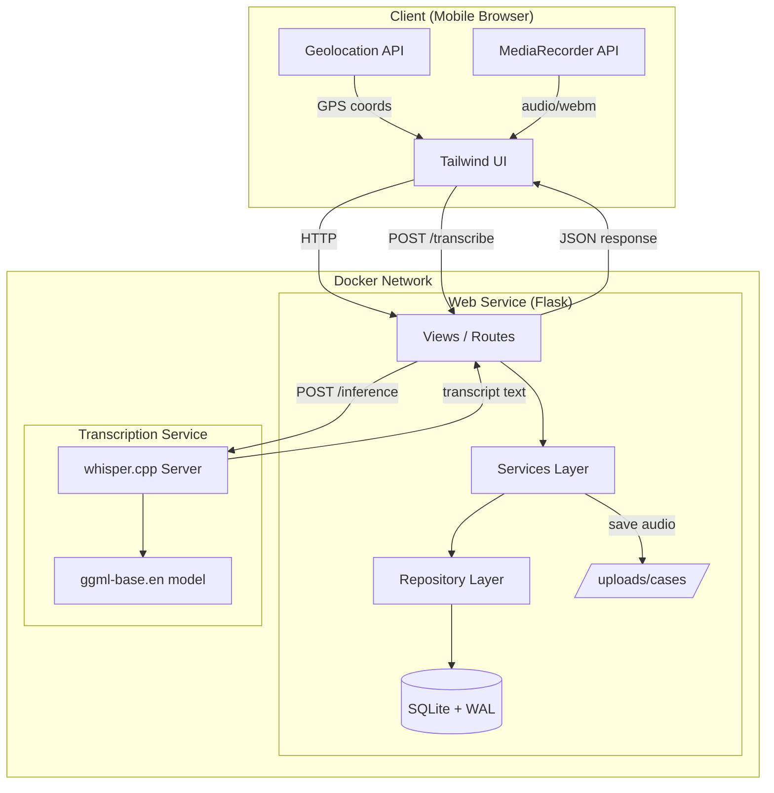
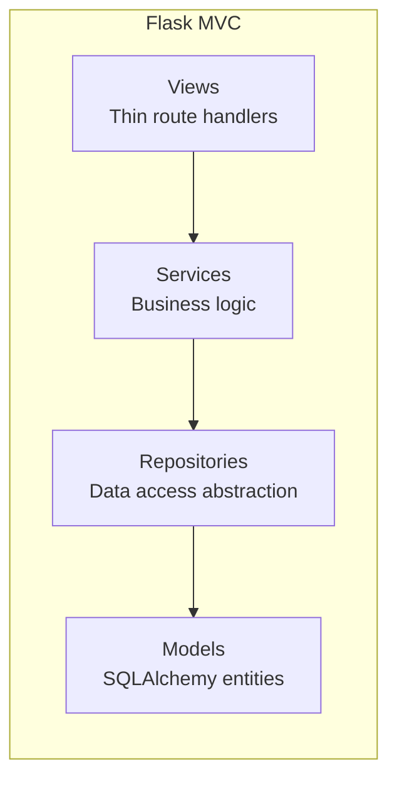
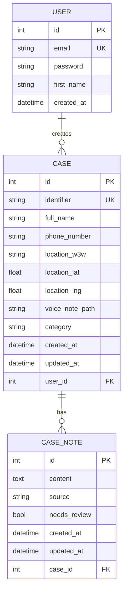
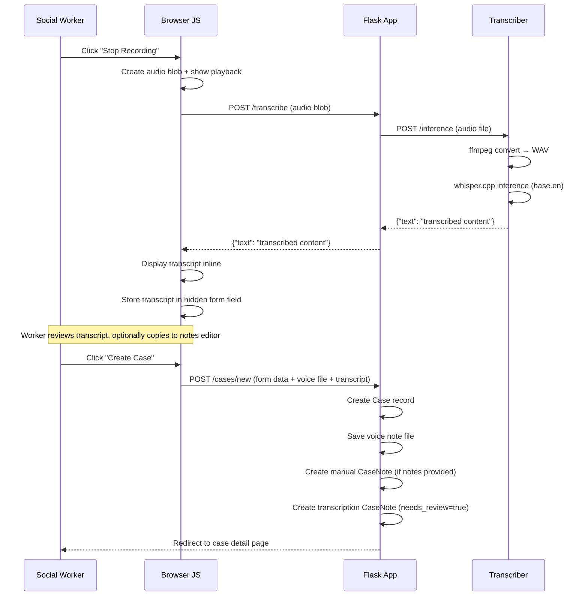
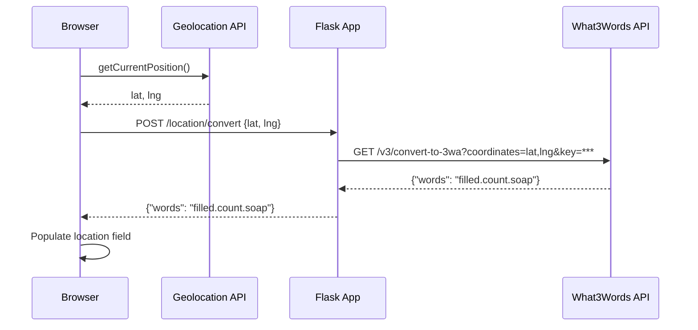

## Overview

Quick Capture MVP is a case management tool for Simon on the Streets social workers. It enables rapid recording of interactions with prospects — capturing names, locations, notes, and voice recordings with minimal friction.

The system is composed of two services running in Docker containers on the same network:

1. **Web Application** — Flask-based MVC app serving the UI and handling business logic
2. **Transcription Service** — whisper.cpp HTTP server that converts audio recordings to text

## System Architecture



## Application Structure



### Directory Layout

```
├── main.py                        Entry point
├── config.py                      App configuration (Dev/Prod)
├── requirements.txt               Python dependencies (pinned)
├── Dockerfile                     Web service container
├── docker-compose.yml             Multi-service orchestration
├── app/
│   ├── __init__.py                App factory
│   ├── extensions.py              SQLAlchemy, LoginManager
│   ├── models/
│   │   ├── user.py                User entity
│   │   ├── case.py                Case entity
│   │   └── case_note.py           CaseNote entity
│   ├── repositories/
│   │   ├── base.py                Abstract base repository
│   │   ├── user_repository.py     User data access
│   │   ├── case_repository.py     Case data access
│   │   └── case_note_repository.py Note data access
│   ├── services/
│   │   ├── auth_service.py        Authentication logic
│   │   ├── case_service.py        Case + notes business logic
│   │   ├── identifier_service.py  Auto-ID generation
│   │   └── transcription_client.py HTTP client for whisper.cpp
│   ├── views/
│   │   ├── auth.py                Login / signup / logout
│   │   └── cases.py               Case CRUD + notes + transcription
│   ├── templates/                 Jinja2 + Tailwind templates
│   └── static/                    JS, CSS
├── services/
│   └── transcriber/
│       └── Dockerfile             whisper.cpp server container
├── uploads/cases/                 Voice note storage (runtime)
└── instance/database.db           SQLite database (runtime)
```

## Data Model



### Case Categories

| Category | Description |
|----------|-------------|
| `non-caseload` | Default. First-time interaction with limited information |
| `caseload` | Ongoing engagement with verified information |
| `client` | Full client relationship established |

### Note Sources

| Source | Description |
|--------|-------------|
| `manual` | Written by the social worker via the WYSIWYG editor |
| `transcription` | Auto-generated from voice note transcription. Flagged with `needs_review = true` |

### Note Creation Rules

- A manual note is only created if the WYSIWYG editor contains meaningful text (empty tags like `<p><br></p>` or whitespace-only content are ignored)
- A transcription note is only created if a voice transcript was successfully obtained before form submission
- Notes are cascade-deleted when their parent case is deleted

## Transcription Flow

Transcription happens **inline on the create form** — the worker sees the transcript immediately after recording, before submitting the case.



### Key Design Choice: Frontend-Driven Transcription

Transcription is triggered by the browser immediately after recording stops, rather than on form submission. This provides:

- **Instant feedback** — the worker sees the transcript within seconds of recording
- **No duplicate processing** — the transcript is obtained once and submitted with the form
- **Review opportunity** — the worker can read the transcript and copy relevant parts into the notes editor before submitting
- **Graceful degradation** — if the transcription service is unavailable, the case can still be created with just the audio file

## Auto-Identifier Generation

When a prospect's name is unknown, the system generates a unique identifier in the format:

```
{LOCATION}-{KEYWORD}-{SEQUENCE}
```

| Component | Source | Example |
|-----------|--------|---------|
| LOCATION | First word of the What3Words address, uppercased | `FILLED` |
| KEYWORD | First meaningful word (4+ chars) from case notes or transcript | `STATION` |
| SEQUENCE | Zero-padded count of existing cases with same prefix | `001` |

Example: `FILLED-STATION-001`

Fallbacks:
- No location → `UNK`
- No notes/transcript → `INTERACTION`

## Location Capture



The What3Words API key is stored server-side as the `W3W_API_KEY` environment variable and never exposed to the client.

## Transcription Service

### Technology

- **whisper.cpp** — C++ port of OpenAI's Whisper model, built statically (`BUILD_SHARED_LIBS=OFF`)
- **Model** — `ggml-base.en` (142MB, English-only, optimised for speed)
- **Audio conversion** — ffmpeg (accepts webm, mp3, ogg, wav, m4a)
- **Container** — Multi-stage Docker build (ubuntu 24.04), minimal runtime with only ffmpeg and libgomp1

### API

The Flask app exposes a `/transcribe` endpoint that proxies requests to the internal whisper.cpp server:

```
POST /transcribe (Flask — called by browser JS)
Content-Type: multipart/form-data
Parameters:
  - audio: audio file blob from MediaRecorder

Response:
  {"text": "the transcribed text content"}
  or {"error": "description"} with 4xx/5xx status
```

Internally, the Flask app forwards to the whisper.cpp server:

```
POST /inference (whisper.cpp — internal only)
Content-Type: multipart/form-data
Parameters:
  - file: audio file (any format, converted internally via ffmpeg)
  - temperature: "0.0" (deterministic output)
  - response_format: "json"

Response:
  {"text": "the transcribed text content"}
```

### Resource Requirements

| Resource | Idle | During Inference |
|----------|------|-----------------|
| RAM | ~150MB | ~500MB |
| CPU | Negligible | 2 threads (configurable) |
| Disk | ~200MB (binary + model) | — |

A 30-second audio clip transcribes in approximately 3–5 seconds on a modern CPU.

## Deployment

### Docker Compose

Both services run in the same Docker network. The transcriber is only accessible internally (no published ports). The web service uses gunicorn with `--preload` to avoid SQLite locking issues with multiple workers.

```bash
# Build and start
docker compose up --build

# The web app is available at http://localhost:5001
# The transcriber is internal-only (not exposed to host)
```

### Environment Variables

| Variable | Service | Default | Description |
|----------|---------|---------|-------------|
| `SECRET_KEY` | web | `change-me-in-production` | Flask session secret |
| `FLASK_ENV` | web | `development` | `development` or `production` |
| `TRANSCRIPTION_URL` | web | `http://transcriber:8080` | Internal URL of transcriber |
| `W3W_API_KEY` | web | (empty) | What3Words API key for location conversion |

### Volumes

| Volume | Purpose |
|--------|---------|
| `db_data` | Persists SQLite database across container restarts |
| `uploads_data` | Persists uploaded voice notes |

### Production Notes

- Gunicorn runs with `--preload` to initialise the app once before forking workers, preventing SQLite WAL pragma race conditions
- The transcriber container is built with `BUILD_SHARED_LIBS=OFF` so the binary is self-contained (no shared library dependencies)
- The web service `depends_on` the transcriber with `condition: service_healthy` to ensure transcription is available before accepting traffic

## Design Decisions

| Decision | Rationale |
|----------|-----------|
| Repository pattern | Abstracts data access so we can swap SQLite for Postgres without changing services or views |
| SQLite with WAL | Good enough concurrency for the MVP; WAL allows concurrent reads during writes |
| Frontend-driven transcription | Worker sees transcript immediately after recording; no duplicate processing on submit |
| Backend W3W proxy | API key stays server-side; client only sends coordinates to our own endpoint |
| whisper.cpp static build | Lowest resource footprint: no Python runtime, no shared library issues, single binary |
| Tailwind via CDN | No build step required for the MVP. Fast iteration without Node tooling |
| Quill.js | Lightweight WYSIWYG (~40KB), mobile-friendly, minimal configuration |
| Notes as separate entity | Supports multiple notes per case, tagging by source, and review workflows |
| Gunicorn with --preload | Prevents multi-worker race conditions on SQLite WAL mode initialisation |
| Empty content detection | Strips HTML tags to check for meaningful text, avoiding empty notes from Quill's default markup |

## Future Considerations

- **Actions** — visits, appointments, and activities performed with caseload clients
- **Database migration** — Alembic for schema versioning when moving to Postgres
- **Real-time collaboration** — WebSocket updates when multiple workers view the same case
- **Offline support** — Service worker to queue voice notes when connectivity is poor
