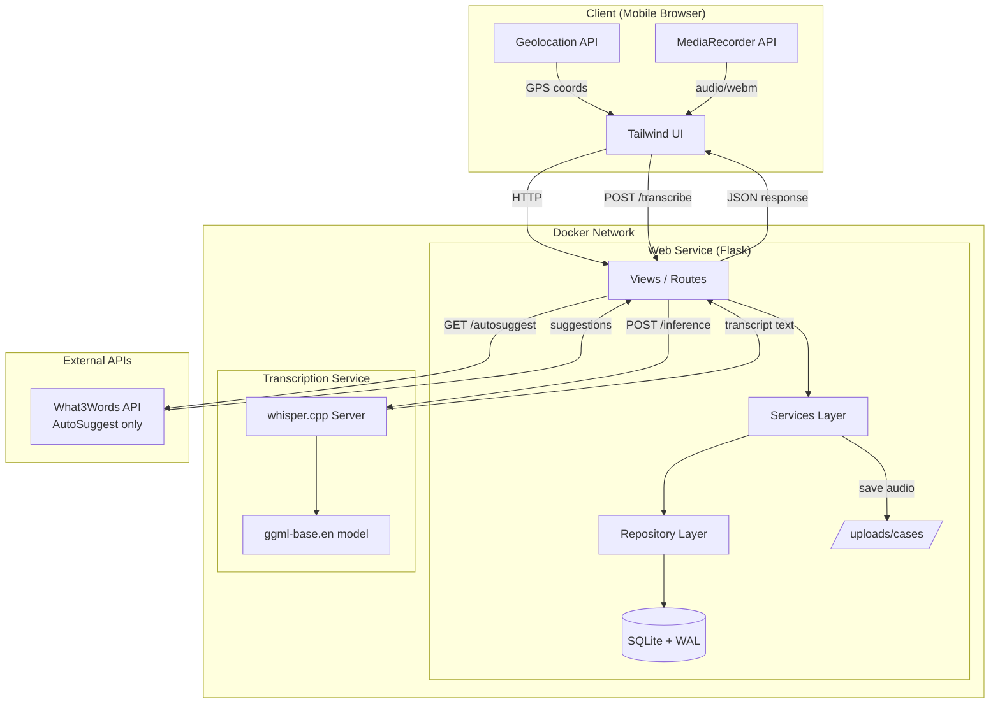
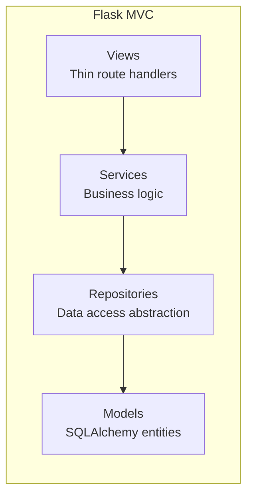
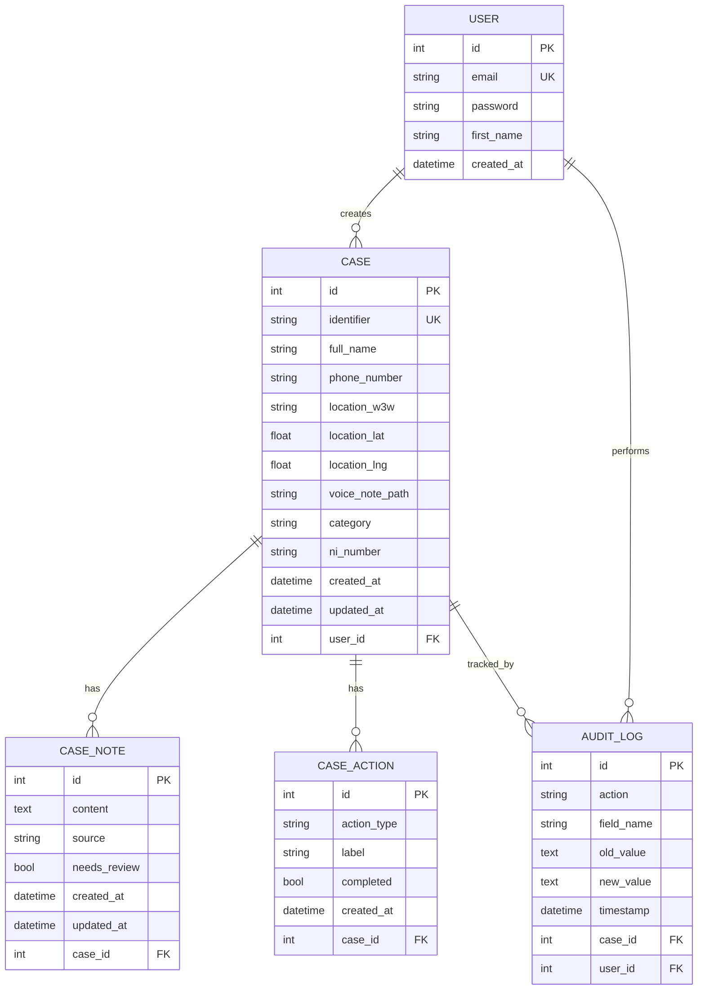
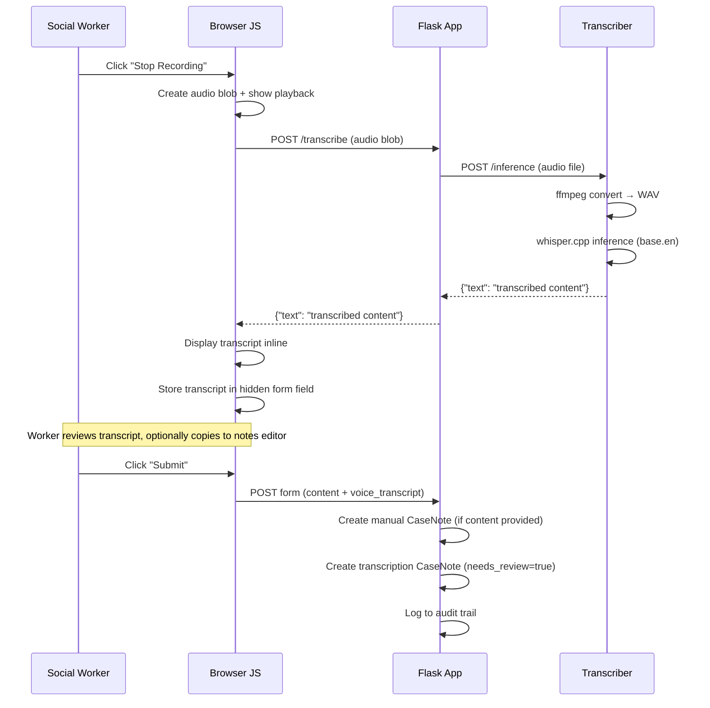
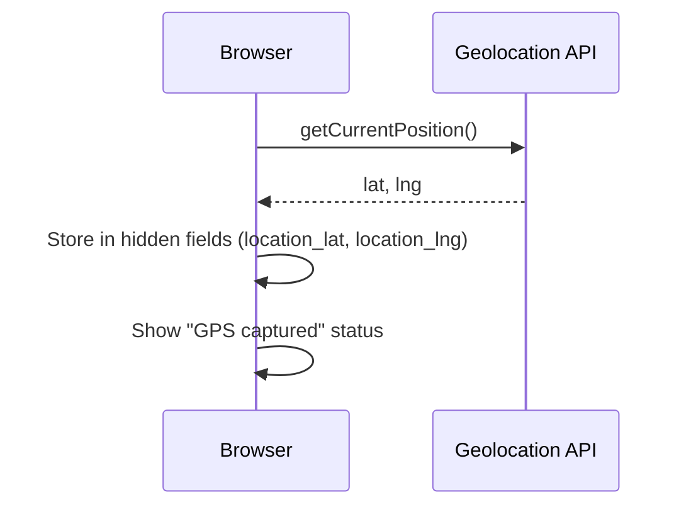
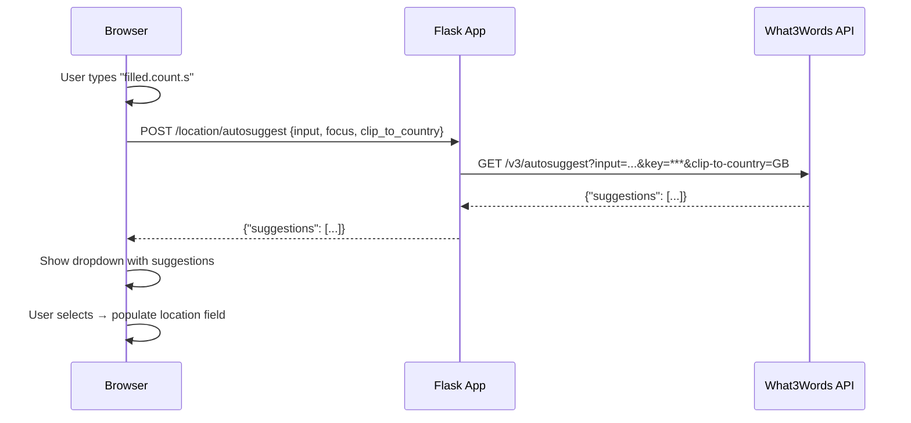

## Overview

Quick Capture [MVP] is a case management tool for Simon on the Streets social workers. It enables rapid recording of interactions with prospects — capturing names, locations, notes, and voice recordings with minimal friction.

The system is composed of two services running in Docker containers on the same network:

1. **Web Application** — Flask-based MVC app serving the UI and handling business logic
2. **Transcription Service** — whisper.cpp HTTP server that converts audio recordings to text

## System Architecture


```mermaid
graph TB
    subgraph Client["Client (Mobile Browser)"]
        UI[Tailwind UI]
        GEO[Geolocation API]
        MIC[MediaRecorder API]
    end

    subgraph Docker["Docker Network"]
        subgraph Web["Web Service (Flask)"]
            VIEWS[Views / Routes]
            SERVICES[Services Layer]
            REPOS[Repository Layer]
            DB[(SQLite + WAL)]
            UPLOADS[/uploads/cases/]
        end

        subgraph Transcriber["Transcription Service"]
            WHISPER[whisper.cpp Server]
            MODEL[ggml-base.en model]
        end
    end

    subgraph External["External APIs"]
        W3W[What3Words API<br/>AutoSuggest only]
    end

    UI -->|HTTP| VIEWS
    GEO -->|GPS coords| UI
    MIC -->|audio/webm| UI

    VIEWS --> SERVICES
    SERVICES --> REPOS
    REPOS --> DB
    SERVICES -->|save audio| UPLOADS
    UI -->|POST /transcribe| VIEWS
    VIEWS -->|POST /inference| WHISPER
    WHISPER --> MODEL
    WHISPER -->|transcript text| VIEWS
    VIEWS -->|JSON response| UI
    VIEWS -->|GET /autosuggest| W3W
    W3W -->|suggestions| VIEWS
```

## Application Structure


```mermaid
graph LR
    subgraph MVC["Flask MVC"]
        V[Views<br/>Thin route handlers]
        S[Services<br/>Business logic]
        R[Repositories<br/>Data access abstraction]
        M[Models<br/>SQLAlchemy entities]
    end

    V --> S
    S --> R
    R --> M
```

### Directory Layout

```
├── main.py                        Entry point
├── config.py                      App configuration (Dev/Prod)
├── requirements.txt               Python dependencies (pinned)
├── Dockerfile                     Web service container
├── docker-compose.yml             Multi-service orchestration
├── .env                           Environment variables (all config)
├── app/
│   ├── __init__.py                App factory
│   ├── extensions.py              SQLAlchemy, LoginManager
│   ├── models/
│   │   ├── user.py                User entity
│   │   ├── case.py                Case entity (+ ni_number, actions relationship)
│   │   ├── case_note.py           CaseNote entity
│   │   ├── case_action.py         CaseAction entity (caseload actions)
│   │   └── audit_log.py           AuditLog entity (change history)
│   ├── repositories/
│   │   ├── base.py                Abstract base repository
│   │   ├── user_repository.py     User data access
│   │   ├── case_repository.py     Case data access
│   │   ├── case_note_repository.py Note data access
│   │   ├── case_action_repository.py Action data access
│   │   └── audit_log_repository.py  Audit log data access
│   ├── services/
│   │   ├── auth_service.py        Authentication logic
│   │   ├── case_service.py        Case + notes + actions business logic
│   │   ├── identifier_service.py  Auto-ID generation
│   │   ├── transcription_client.py HTTP client for whisper.cpp
│   │   ├── w3w_service.py         What3Words API client (autosuggest)
│   │   └── audit_service.py       Audit trail logging
│   ├── views/
│   │   ├── auth.py                Login / signup / logout
│   │   └── cases.py               Case CRUD + notes + actions + transcription + location
│   ├── templates/                 Jinja2 + Tailwind templates
│   └── static/                    JS, CSS
├── services/
│   └── transcriber/
│       └── Dockerfile             whisper.cpp server container
├── docs/
│   ├── architecture.md            This file
│   └── adrs/                      Architecture Decision Records
│       ├── 001-what3words-integration.md
│       ├── 002-audit-trail.md
│       ├── 003-inline-editing.md
│       ├── 004-category-contextual-fields.md
│       └── 005-voice-notes-on-existing-cases.md
├── uploads/cases/                 Voice note storage (runtime)
└── instance/database.db           SQLite database (runtime)
```

## Data Model


```mermaid
erDiagram
    USER ||--o{ CASE : creates
    USER ||--o{ AUDIT_LOG : performs
    CASE ||--o{ CASE_NOTE : has
    CASE ||--o{ CASE_ACTION : has
    CASE ||--o{ AUDIT_LOG : tracked_by

    USER {
        int id PK
        string email UK
        string password
        string first_name
        datetime created_at
    }

    CASE {
        int id PK
        string identifier UK
        string full_name
        string phone_number
        string location_w3w
        float location_lat
        float location_lng
        string voice_note_path
        string category
        string ni_number
        datetime created_at
        datetime updated_at
        int user_id FK
    }

    CASE_NOTE {
        int id PK
        text content
        string source
        bool needs_review
        datetime created_at
        datetime updated_at
        int case_id FK
    }

    CASE_ACTION {
        int id PK
        string action_type
        string label
        bool completed
        datetime created_at
        int case_id FK
    }

    AUDIT_LOG {
        int id PK
        string action
        string field_name
        text old_value
        text new_value
        datetime timestamp
        int case_id FK
        int user_id FK
    }
```

### Case Categories

| Category | Description | Contextual Requirements |
|----------|-------------|------------------------|
| `non-caseload` | Default. First-time interaction with limited information | None |
| `caseload` | Ongoing engagement with verified information | Actions checklist (predefined + custom) |
| `client` | Full client relationship established | National Insurance number (required) |

### Predefined Actions (Caseload)

| Action Type | Label |
|-------------|-------|
| `home_visit` | Home visit |
| `referral_gp` | Referral to GP |
| `benefits_application` | Benefits application |
| `housing_referral` | Housing referral |
| `mental_health_referral` | Mental health referral |
| `substance_support` | Substance misuse support |
| `food_bank_referral` | Food bank referral |
| `appointment_booked` | Appointment booked |

Custom actions can be added via free-text input with `action_type = "custom"`.

### Note Sources

| Source | Description |
|--------|-------------|
| `manual` | Written by the social worker via the WYSIWYG editor |
| `transcription` | Auto-generated from voice note transcription. Flagged with `needs_review = true` |

### Note Creation Rules

- A manual note is only created if the WYSIWYG editor contains meaningful text (empty tags like `<p><br></p>` or whitespace-only content are ignored)
- A transcription note is only created if a voice transcript was successfully obtained before form submission
- Notes are cascade-deleted when their parent case is deleted
- Notes can be added with voice transcription on existing cases (not just during creation)

### Audit Trail

Every mutation to a case is logged in the `audit_logs` table:

| Action | When Logged |
|--------|-------------|
| `created` | Case created, note added |
| `updated` | Field edited, category changed, note content edited, note reviewed, actions updated |
| `deleted` | Case deleted, note deleted |

The audit trail is viewable on the case detail page via a collapsible "Activity" section.

## Routes

### Authentication (`auth_bp`)

| Method | Path | Description |
|--------|------|-------------|
| GET/POST | `/login` | Login form + authentication |
| GET | `/logout` | Logout + redirect |
| GET/POST | `/sign-up` | Registration form |

### Cases (`cases_bp`)

| Method | Path | Description |
|--------|------|-------------|
| GET | `/` | Public landing page |
| GET | `/dashboard` | Authenticated case list |
| GET/POST | `/cases/new` | Create case form |
| GET | `/cases/<id>` | Case detail with notes |
| POST | `/cases/<id>/edit` | Update case fields (AJAX) |
| POST | `/cases/<id>/delete` | Delete case |
| POST | `/cases/<id>/category` | Update category + NI number (AJAX) |
| GET | `/cases/<id>/actions` | Get actions for case (AJAX) |
| POST | `/cases/<id>/actions` | Update actions for case (AJAX) |
| GET | `/cases/<id>/audit` | Get audit trail (AJAX) |
| POST | `/cases/<id>/notes` | Add note (manual + voice transcript) |
| POST | `/cases/<id>/notes/<id>/edit` | Edit note content (AJAX) |
| POST | `/cases/<id>/notes/<id>/delete` | Delete note |
| POST | `/cases/<id>/notes/<id>/review` | Mark note reviewed (AJAX) |
| POST | `/transcribe` | Transcribe audio file (AJAX) |
| POST | `/location/autosuggest` | What3Words autosuggest (AJAX) |

## Transcription Flow

Transcription happens **inline** — both on the create form and when adding notes to existing cases. The worker sees the transcript immediately after recording, before submitting.


```mermaid
sequenceDiagram
    participant W as Social Worker
    participant Browser as Browser JS
    participant App as Flask App
    participant T as Transcriber

    W->>Browser: Click "Stop Recording"
    Browser->>Browser: Create audio blob + show playback
    Browser->>App: POST /transcribe (audio blob)
    App->>T: POST /inference (audio file)
    T->>T: ffmpeg convert → WAV
    T->>T: whisper.cpp inference (base.en)
    T-->>App: {"text": "transcribed content"}
    App-->>Browser: {"text": "transcribed content"}
    Browser->>Browser: Display transcript inline
    Browser->>Browser: Store transcript in hidden form field
    Note over W,Browser: Worker reviews transcript, optionally copies to notes editor
    W->>Browser: Click "Submit"
    Browser->>App: POST form (content + voice_transcript)
    App->>App: Create manual CaseNote (if content provided)
    App->>App: Create transcription CaseNote (needs_review=true)
    App->>App: Log to audit trail
```

## Location Capture

Two complementary approaches:

### 1. GPS Capture (always available)


```mermaid
sequenceDiagram
    participant B as Browser
    participant GPS as Geolocation API

    B->>GPS: getCurrentPosition()
    GPS-->>B: lat, lng
    B->>B: Store in hidden fields (location_lat, location_lng)
    B->>B: Show "GPS captured" status
```

### 2. What3Words AutoSuggest (Free plan)


```mermaid
sequenceDiagram
    participant B as Browser
    participant App as Flask App
    participant W3W as What3Words API

    B->>B: User types "filled.count.s"
    B->>App: POST /location/autosuggest {input, focus, clip_to_country}
    App->>W3W: GET /v3/autosuggest?input=...&key=***&clip-to-country=GB
    W3W-->>App: {"suggestions": [...]}
    App-->>B: {"suggestions": [...]}
    B->>B: Show dropdown with suggestions
    B->>B: User selects → populate location field
```

The What3Words API key is stored server-side as the `W3W_API_KEY` environment variable and never exposed to the client. See [ADR-001](adrs/001-what3words-integration.md) for plan limitations.

## Inline Editing

Case fields and notes are editable on the detail page:

**Editable:** full_name, phone_number, note content, category
**Not editable:** location, created_at, identifier

The edit pattern uses click-to-reveal inputs with Save/Cancel controls. All edits are persisted via AJAX and logged to the audit trail. See [ADR-003](adrs/003-inline-editing.md).

## Auto-Identifier Generation

When a prospect's name is unknown, the system generates a unique identifier in the format:

```
{LOCATION}-{KEYWORD}-{SEQUENCE}
```

| Component | Source | Example |
|-----------|--------|---------|
| LOCATION | First word of the What3Words address, uppercased | `FILLED` |
| KEYWORD | First meaningful word (4+ chars) from case notes or transcript | `STATION` |
| SEQUENCE | Zero-padded count of existing cases with same prefix | `001` |

Example: `FILLED-STATION-001`

Fallbacks:
- No location → `UNK`
- No notes/transcript → `INTERACTION`

## Transcription Service

### Technology

- **whisper.cpp** — C++ port of OpenAI's Whisper model, built statically (`BUILD_SHARED_LIBS=OFF`)
- **Model** — `ggml-base.en` (142MB, English-only, optimised for speed)
- **Audio conversion** — ffmpeg (accepts webm, mp3, ogg, wav, m4a)
- **Container** — Multi-stage Docker build (ubuntu 24.04), minimal runtime with only ffmpeg and libgomp1

### API

The Flask app exposes a `/transcribe` endpoint that proxies requests to the internal whisper.cpp server:

```
POST /transcribe (Flask — called by browser JS)
Content-Type: multipart/form-data
Parameters:
  - audio: audio file blob from MediaRecorder

Response:
  {"text": "the transcribed text content"}
  or {"error": "description"} with 4xx/5xx status
```

Internally, the Flask app forwards to the whisper.cpp server:

```
POST /inference (whisper.cpp — internal only)
Content-Type: multipart/form-data
Parameters:
  - file: audio file (any format, converted internally via ffmpeg)
  - temperature: "0.0" (deterministic output)
  - response_format: "json"

Response:
  {"text": "the transcribed text content"}
```

### Resource Requirements

| Resource | Idle | During Inference |
|----------|------|-----------------|
| RAM | ~150MB | ~500MB |
| CPU | Negligible | 2 threads (configurable) |
| Disk | ~200MB (binary + model) | — |

A 30-second audio clip transcribes in approximately 3–5 seconds on a modern CPU.

## Deployment

### Docker Compose

Both services run in the same Docker network. The transcriber is only accessible internally (no published ports). The web service uses gunicorn with `--preload` to avoid SQLite locking issues with multiple workers.

```bash
# Build and start
docker compose up --build

# The web app is available at http://localhost:5001
# The transcriber is internal-only (not exposed to host)
```

### Environment Variables (`.env`)

| Variable | Default | Description |
|----------|---------|-------------|
| `FLASK_ENV` | `production` | `development` or `production` |
| `SECRET_KEY` | `change-me-in-production` | Flask session secret |
| `TRANSCRIPTION_URL` | `http://transcriber:8080` | Internal URL of transcriber |
| `W3W_API_KEY` | (empty) | What3Words API key for autosuggest |

All environment configuration is managed via the `.env` file, loaded by Docker Compose's `env_file` directive.

### Volumes

| Volume | Purpose |
|--------|---------|
| `db_data` | Persists SQLite database across container restarts |
| `uploads_data` | Persists uploaded voice notes |

### Production Notes

- Gunicorn runs with `--preload` to initialise the app once before forking workers, preventing SQLite WAL pragma race conditions
- The transcriber container is built with `BUILD_SHARED_LIBS=OFF` so the binary is self-contained (no shared library dependencies)
- The web service `depends_on` the transcriber with `condition: service_healthy` to ensure transcription is available before accepting traffic

## Design Decisions

| Decision | Rationale |
|----------|-----------|
| Repository pattern | Abstracts data access so we can swap SQLite for Postgres without changing services or views |
| SQLite with WAL | Good enough concurrency for the MVP; WAL allows concurrent reads during writes |
| Frontend-driven transcription | Worker sees transcript immediately after recording; no duplicate processing on submit |
| Backend W3W proxy | API key stays server-side; client only sends partial address to our own endpoint |
| W3W Free plan (autosuggest only) | Sufficient for address entry with autocomplete; GPS handles coordinate capture |
| whisper.cpp static build | Lowest resource footprint: no Python runtime, no shared library issues, single binary |
| Tailwind via CDN | No build step required for the MVP. Fast iteration without Node tooling |
| Quill.js | Lightweight WYSIWYG (~40KB), mobile-friendly, minimal configuration |
| Notes as separate entity | Supports multiple notes per case, tagging by source, and review workflows |
| Audit trail (append-only) | Full change history for accountability; service-level logging for meaningful entries |
| Inline editing with AJAX | Minimal friction for corrections; no page reload needed |
| Category-contextual fields | Progressive disclosure: only show actions/NI when relevant to the category |
| Voice notes on existing cases | Workers need to add follow-up recordings, not just during initial creation |
| Gunicorn with --preload | Prevents multi-worker race conditions on SQLite WAL mode initialisation |
| Empty content detection | Strips HTML tags to check for meaningful text, avoiding empty notes from Quill's default markup |
| env_file over inline env | Single source of truth for configuration; cleaner compose file |

## Architecture Decision Records

Detailed rationale for significant decisions is documented in `/docs/adrs/`:

- [ADR-001: What3Words Integration](adrs/001-what3words-integration.md) — Free plan autosuggest, GPS fallback
- [ADR-002: Audit Trail](adrs/002-audit-trail.md) — append-only change log, service-level logging
- [ADR-003: Inline Editing](adrs/003-inline-editing.md) — click-to-edit pattern, immutable fields
- [ADR-004: Category-Based Contextual Fields](adrs/004-category-contextual-fields.md) — actions for caseload, NI for client
- [ADR-005: Voice Notes on Existing Cases](adrs/005-voice-notes-on-existing-cases.md) — transcribe-only (no audio persistence)
- [ADR-006: Lightweight Migrations](adrs/006-lightweight-migrations.md) — startup schema migrations for SQLite

## Future Considerations

- **Actions** — expand action tracking with completion dates and worker notes
- **Database migration** — Alembic for schema versioning when moving to Postgres
- **Real-time collaboration** — WebSocket updates when multiple workers view the same case
- **Offline support** — Service worker to queue voice notes when connectivity is poor
- **W3W Business plan** — upgrade to enable GPS → what3words auto-conversion
- **NI number encryption** — encrypt PII fields at rest
- **Audit archival** — archive audit entries older than N months to manage table growth
- **File attachments** — support photos, documents beyond voice notes
