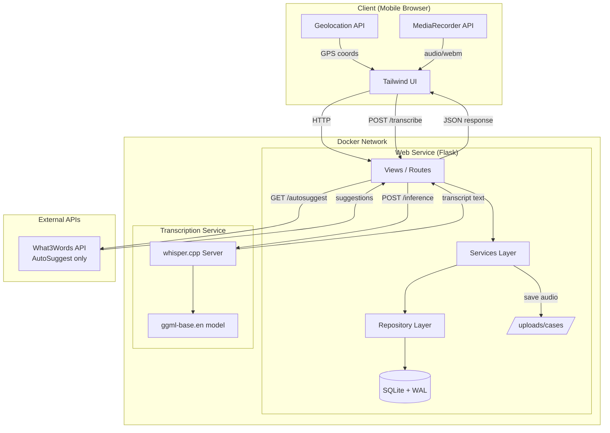
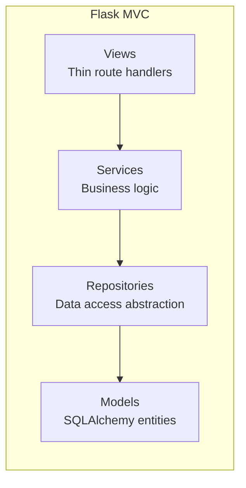
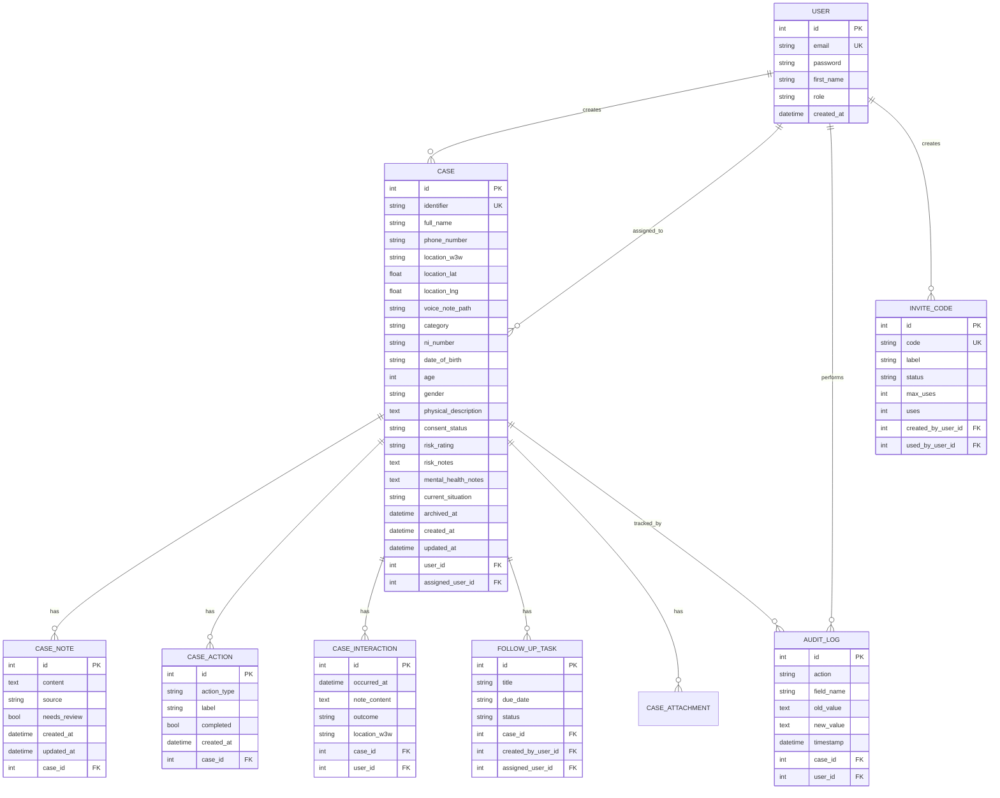
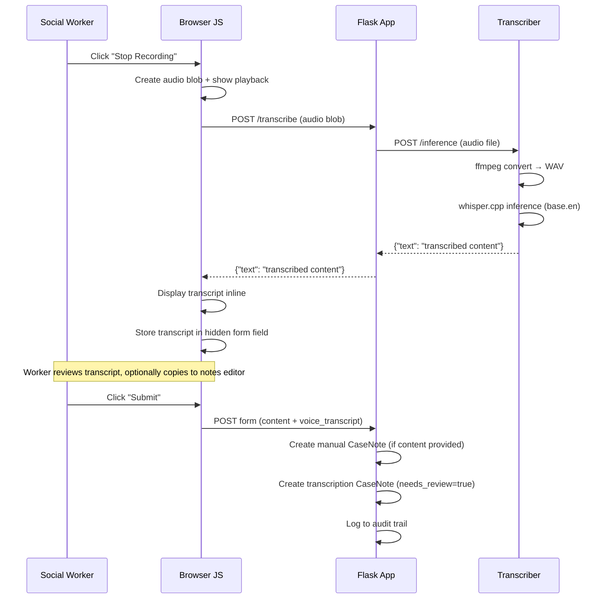
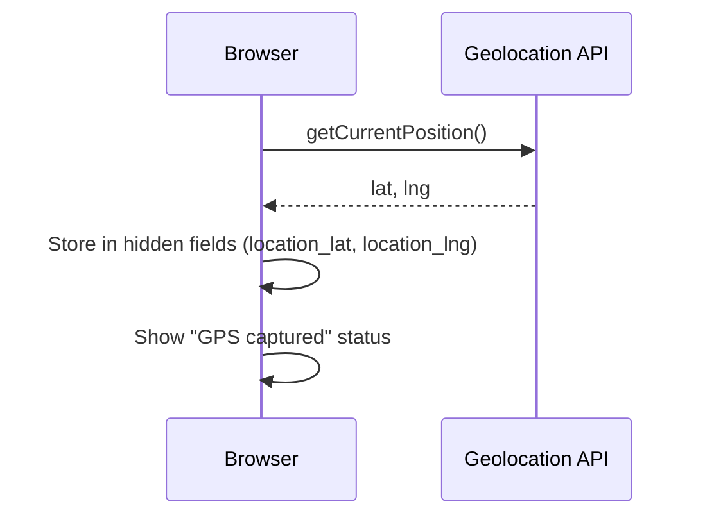
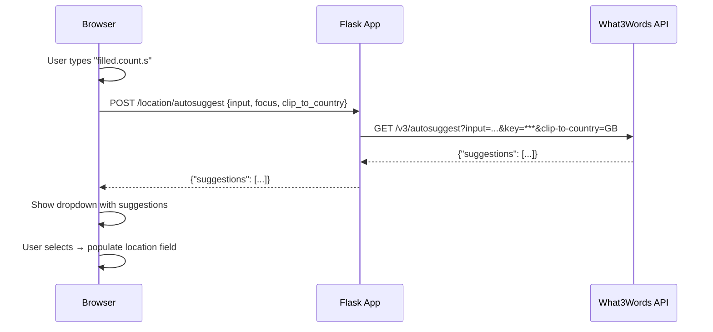

## Overview

Quick Capture [MVP] is a case management tool for Simon on the Streets social workers. It enables rapid recording of interactions with prospects — capturing names, locations, notes, structured interaction tags, documents, follow-ups and voice recordings with minimal friction.

The system is composed of two services running in Docker containers on the same network:

1. **Web Application** — Flask-based MVC app serving the UI and handling business logic
2. **Transcription Service** — whisper.cpp HTTP server that converts audio recordings to text

## System Architecture


```mermaid
graph TB
    subgraph Client["Client (Mobile Browser)"]
        UI[Tailwind UI]
        GEO[Geolocation API]
        MIC[MediaRecorder API]
    end

    subgraph Docker["Docker Network"]
        subgraph Web["Web Service (Flask)"]
            VIEWS[Views / Routes]
            SERVICES[Services Layer]
            REPOS[Repository Layer]
            DB[(SQLite + WAL)]
            UPLOADS[/uploads/cases/]
        end

        subgraph Transcriber["Transcription Service"]
            WHISPER[whisper.cpp Server]
            MODEL[ggml-base.en model]
        end
    end

    subgraph External["External APIs"]
        W3W[What3Words API<br/>AutoSuggest only]
    end

    UI -->|HTTP| VIEWS
    GEO -->|GPS coords| UI
    MIC -->|audio/webm| UI

    VIEWS --> SERVICES
    SERVICES --> REPOS
    REPOS --> DB
    SERVICES -->|save audio| UPLOADS
    UI -->|POST /transcribe| VIEWS
    VIEWS -->|POST /inference| WHISPER
    WHISPER --> MODEL
    WHISPER -->|transcript text| VIEWS
    VIEWS -->|JSON response| UI
    VIEWS -->|GET /autosuggest| W3W
    W3W -->|suggestions| VIEWS
```

## Application Structure


```mermaid
graph LR
    subgraph MVC["Flask MVC"]
        V[Views<br/>Thin route handlers]
        S[Services<br/>Business logic]
        R[Repositories<br/>Data access abstraction]
        M[Models<br/>SQLAlchemy entities]
    end

    V --> S
    S --> R
    R --> M
```

### Directory Layout

```
├── main.py                        Entry point
├── config.py                      App configuration (Dev/Prod)
├── requirements.txt               Python dependencies (pinned)
├── Dockerfile                     Web service container
├── docker-compose.yml             Multi-service orchestration
├── .env                           Environment variables (all config)
├── app/
│   ├── __init__.py                App factory
│   ├── extensions.py              SQLAlchemy, LoginManager
│   ├── models/
│   │   ├── user.py                User entity with worker/admin roles
│   │   ├── case.py                Case entity with identity, risk, consent and status fields
│   │   ├── case_note.py           CaseNote entity
│   │   ├── case_action.py         CaseAction entity (caseload actions)
│   │   ├── case_interaction.py    Interaction timeline + reporting tags
│   │   ├── follow_up_task.py      Follow-up tasks
│   │   ├── case_attachment.py     Uploaded case documents
│   │   ├── invite_code.py         Admin-created signup invite codes
│   │   └── audit_log.py           AuditLog entity (change history)
│   ├── repositories/
│   │   ├── base.py                Abstract base repository
│   │   ├── user_repository.py     User data access
│   │   ├── case_repository.py     Case data access
│   │   ├── case_note_repository.py Note data access
│   │   ├── case_action_repository.py Action data access
│   │   └── audit_log_repository.py  Audit log data access
│   ├── services/
│   │   ├── auth_service.py        Authentication and invite validation
│   │   ├── invite_service.py      Invite creation, consumption and denial
│   │   ├── seed_service.py        Local demo admin account seeding
│   │   ├── case_service.py        Case, notes, interactions, follow-ups and files
│   │   ├── html_service.py        HTML sanitisation
│   │   ├── csrf_service.py        CSRF protection for forms and AJAX
│   │   ├── identifier_service.py  Auto-ID generation
│   │   ├── transcription_client.py HTTP client for whisper.cpp
│   │   ├── w3w_service.py         What3Words API client (autosuggest)
│   │   └── audit_service.py       Audit trail logging
│   ├── views/
│   │   ├── auth.py                Login / signup / logout / invite management
│   │   └── cases.py               Case CRUD + interactions + reports + transcription + location
│   ├── templates/                 Jinja2 + Tailwind templates
│   └── static/                    JS, CSS
├── services/
│   └── transcriber/
│       └── Dockerfile             whisper.cpp server container
├── docs/
│   ├── architecture.md            This file
│   └── adrs/                      Architecture Decision Records
│       ├── 001-what3words-integration.md
│       ├── 002-audit-trail.md
│       ├── 003-inline-editing.md
│       ├── 004-category-contextual-fields.md
│       └── 005-voice-notes-on-existing-cases.md
├── uploads/cases/                 Voice note storage (runtime)
└── instance/database.db           SQLite database (runtime)
```

## Data Model


```mermaid
erDiagram
    USER ||--o{ CASE : creates
    USER ||--o{ CASE : assigned_to
    USER ||--o{ AUDIT_LOG : performs
    USER ||--o{ INVITE_CODE : creates
    CASE ||--o{ CASE_NOTE : has
    CASE ||--o{ CASE_ACTION : has
    CASE ||--o{ CASE_INTERACTION : has
    CASE ||--o{ FOLLOW_UP_TASK : has
    CASE ||--o{ CASE_ATTACHMENT : has
    CASE ||--o{ AUDIT_LOG : tracked_by

    USER {
        int id PK
        string email UK
        string password
        string first_name
        string role
        datetime created_at
    }

    CASE {
        int id PK
        string identifier UK
        string full_name
        string phone_number
        string location_w3w
        float location_lat
        float location_lng
        string voice_note_path
        string category
        string ni_number
        string date_of_birth
        int age
        string gender
        text physical_description
        string consent_status
        string risk_rating
        text risk_notes
        text mental_health_notes
        string current_situation
        datetime archived_at
        datetime created_at
        datetime updated_at
        int user_id FK
        int assigned_user_id FK
    }

    CASE_NOTE {
        int id PK
        text content
        string source
        bool needs_review
        datetime created_at
        datetime updated_at
        int case_id FK
    }

    CASE_ACTION {
        int id PK
        string action_type
        string label
        bool completed
        datetime created_at
        int case_id FK
    }

    CASE_INTERACTION {
        int id PK
        datetime occurred_at
        text note_content
        string outcome
        string location_w3w
        int case_id FK
        int user_id FK
    }

    FOLLOW_UP_TASK {
        int id PK
        string title
        string due_date
        string status
        int case_id FK
        int created_by_user_id FK
        int assigned_user_id FK
    }

    INVITE_CODE {
        int id PK
        string code UK
        string label
        string status
        int max_uses
        int uses
        int created_by_user_id FK
        int used_by_user_id FK
    }

    AUDIT_LOG {
        int id PK
        string action
        string field_name
        text old_value
        text new_value
        datetime timestamp
        int case_id FK
        int user_id FK
    }
```

### Access Control

Users have either `worker` or `admin` roles. Workers can view active team cases, create case records, add interactions, complete follow-ups, upload documents and use reporting views. Admins can also manage invite codes.

Local development seeds a demo admin account when `DEMO_ACCOUNT_ENABLED=true`. When `DEMO_CASES_ENABLED=true`, the app also seeds 10 fictional demo cases under that account so a fresh local install can demonstrate case status, risk, notes, interaction tags, follow-ups, reports and document uploads. Demo case identifiers use the `DEMO-` prefix. Restarting the app does not create duplicate demo cases.

Production disables the demo account and demo cases by default. Signup accepts either an enabled bootstrap invite code or an active database-backed invite code. Database invite codes are created by admins, can be limited to a defined number of uses, and can be denied before use.

### Case Status Vocabulary

The UI labels this field `Case status` while preserving the documented SOTS terms `Non-caseload`, `Caseload`, and `Client`.

| Stored value | UI label | Description | Contextual Requirements |
|--------------|----------|-------------|------------------------|
| `non-caseload` | Non-caseload | Not currently on the active caseload | None |
| `caseload` | Caseload | Actively supported by the team | Actions checklist (predefined + custom) |
| `client` | Client | Formal client record with fuller identity details | National Insurance number (required) |

Date of birth is treated as authoritative for age when present. The browser fills the `Age` field immediately after DOB entry, and the backend recalculates age from DOB during create/edit requests to avoid stale manual values. Age remains manually enterable when DOB is unknown.

### Predefined Actions (Caseload)

| Action Type | Label |
|-------------|-------|
| `home_visit` | Home visit |
| `referral_gp` | Referral to GP |
| `benefits_application` | Benefits application |
| `housing_referral` | Housing referral |
| `mental_health_referral` | Mental health referral |
| `substance_support` | Substance misuse support |
| `food_bank_referral` | Food bank referral |
| `appointment_booked` | Appointment booked |

Custom actions can be added via free-text input with `action_type = "custom"`.

### Note Sources

| Source | Description |
|--------|-------------|
| `manual` | Written by the social worker |
| `transcription` | Auto-generated from voice note transcription. Flagged with `needs_review = true` |

### Note Creation Rules

- A manual note is only created if it contains meaningful text
- Stored note and interaction HTML is sanitised before rendering
- A transcription note is only created if a voice transcript was successfully obtained before form submission
- Notes can be added with voice transcription on existing cases (not just during creation)
- Cases are archived rather than deleted so identifiers, history and audit records remain intact

### Audit Trail

Every mutation to a case is logged in the `audit_logs` table:

| Action | When Logged |
|--------|-------------|
| `created` | Case created, note added |
| `updated` | Field edited, category changed, note content edited, note reviewed, actions updated |
| `deleted` | Case archived, note deleted |

The audit trail is viewable on the case detail page via a collapsible "Activity" section.

## Routes

### Authentication (`auth_bp`)

| Method | Path | Description |
|--------|------|-------------|
| GET/POST | `/login` | Login form + authentication |
| GET | `/logout` | Logout + redirect |
| GET/POST | `/sign-up` | Registration form |
| GET/POST | `/invite-codes` | Admin invite-code list and creation |
| POST | `/invite-codes/<id>/deny` | Admin denial of an unused invite code |

### Cases (`cases_bp`)

| Method | Path | Description |
|--------|------|-------------|
| GET | `/` | Public landing page |
| GET | `/dashboard` | Authenticated case list |
| GET/POST | `/cases/new` | Create case form |
| GET | `/cases/<id>` | Case detail with notes |
| POST | `/cases/<id>/edit` | Update case fields (AJAX) |
| POST | `/cases/<id>/delete` | Archive case |
| POST | `/cases/<id>/category` | Update category + NI number (AJAX) |
| GET | `/cases/<id>/actions` | Get actions for case (AJAX) |
| POST | `/cases/<id>/actions` | Update actions for case (AJAX) |
| GET | `/cases/<id>/audit` | Get audit trail (AJAX) |
| POST | `/cases/<id>/notes` | Add note (manual + voice transcript) |
| POST | `/cases/<id>/notes/<id>/edit` | Edit note content (AJAX) |
| POST | `/cases/<id>/notes/<id>/delete` | Delete note |
| POST | `/cases/<id>/notes/<id>/review` | Mark note reviewed (AJAX) |
| POST | `/cases/<id>/interactions` | Add a structured interaction and reporting tags |
| POST | `/cases/<id>/follow-ups` | Add a follow-up task |
| POST | `/cases/<id>/follow-ups/<id>/complete` | Complete a follow-up task |
| POST | `/cases/<id>/attachments` | Upload a case document |
| GET | `/reports` | Reporting dashboard |
| GET | `/reports/export.csv` | CSV export of reporting fields |
| GET | `/service-worker.js` | Offline shell service worker |
| POST | `/transcribe` | Transcribe audio file (AJAX) |
| POST | `/location/autosuggest` | What3Words autosuggest (AJAX) |

## Transcription Flow

Transcription happens **inline** — both on the create form and when adding notes to existing cases. The worker sees the transcript immediately after recording, before submitting.


```mermaid
sequenceDiagram
    participant W as Social Worker
    participant Browser as Browser JS
    participant App as Flask App
    participant T as Transcriber

    W->>Browser: Click "Stop Recording"
    Browser->>Browser: Create audio blob + show playback
    Browser->>App: POST /transcribe (audio blob)
    App->>T: POST /inference (audio file)
    T->>T: ffmpeg convert → WAV
    T->>T: whisper.cpp inference (base.en)
    T-->>App: {"text": "transcribed content"}
    App-->>Browser: {"text": "transcribed content"}
    Browser->>Browser: Display transcript inline
    Browser->>Browser: Store transcript in hidden form field
    Note over W,Browser: Worker reviews transcript, optionally copies to notes editor
    W->>Browser: Click "Submit"
    Browser->>App: POST form (content + voice_transcript)
    App->>App: Create manual CaseNote (if content provided)
    App->>App: Create transcription CaseNote (needs_review=true)
    App->>App: Log to audit trail
```

## Location Capture

Two complementary approaches:

### 1. GPS Capture (always available)


```mermaid
sequenceDiagram
    participant B as Browser
    participant GPS as Geolocation API

    B->>GPS: getCurrentPosition()
    GPS-->>B: lat, lng
    B->>B: Store in hidden fields (location_lat, location_lng)
    B->>B: Show "GPS captured" status
```

### 2. What3Words AutoSuggest (Free plan)


```mermaid
sequenceDiagram
    participant B as Browser
    participant App as Flask App
    participant W3W as What3Words API

    B->>B: User types "filled.count.s"
    B->>App: POST /location/autosuggest {input, focus, clip_to_country}
    App->>W3W: GET /v3/autosuggest?input=...&key=***&clip-to-country=GB
    W3W-->>App: {"suggestions": [...]}
    App-->>B: {"suggestions": [...]}
    B->>B: Show dropdown with suggestions
    B->>B: User selects → populate location field
```

The What3Words API key is stored server-side as the `W3W_API_KEY` environment variable and never exposed to the client. See [ADR-001](adrs/001-what3words-integration.md) for plan limitations.

## Inline Editing

Case fields and notes are editable on the detail page, which is organised as one page with collapsible sections:

**Editable:** full_name, phone_number, note content, category and priority case fields
**Not editable:** location, created_at, identifier

The edit pattern uses click-to-reveal inputs with Save/Cancel controls. All edits are persisted via AJAX and logged to the audit trail. See [ADR-003](adrs/003-inline-editing.md).

## Auto-Identifier Generation

When a prospect's name is unknown, the system generates a unique identifier in the format:

```
{LOCATION}-{KEYWORD}-{SEQUENCE}
```

| Component | Source | Example |
|-----------|--------|---------|
| LOCATION | First word of the What3Words address, uppercased | `FILLED` |
| KEYWORD | First meaningful word (4+ chars) from case notes or transcript | `STATION` |
| SEQUENCE | Zero-padded count of existing cases with same prefix | `001` |

Example: `FILLED-STATION-001`

Fallbacks:
- No location → `UNK`
- No notes/transcript → `INTERACTION`

## Transcription Service

### Technology

- **whisper.cpp** — C++ port of OpenAI's Whisper model, built statically (`BUILD_SHARED_LIBS=OFF`)
- **Model** — `ggml-base.en` (142MB, English-only, optimised for speed)
- **Audio conversion** — ffmpeg (accepts webm, mp3, ogg, wav, m4a)
- **Container** — Multi-stage Docker build (ubuntu 24.04), minimal runtime with only ffmpeg and libgomp1

### API

The Flask app exposes a `/transcribe` endpoint that proxies requests to the internal whisper.cpp server:

```
POST /transcribe (Flask — called by browser JS)
Content-Type: multipart/form-data
Parameters:
  - audio: audio file blob from MediaRecorder

Response:
  {"text": "the transcribed text content"}
  or {"error": "description"} with 4xx/5xx status
```

Internally, the Flask app forwards to the whisper.cpp server:

```
POST /inference (whisper.cpp — internal only)
Content-Type: multipart/form-data
Parameters:
  - file: audio file (any format, converted internally via ffmpeg)
  - temperature: "0.0" (deterministic output)
  - response_format: "json"

Response:
  {"text": "the transcribed text content"}
```

### Resource Requirements

| Resource | Idle | During Inference |
|----------|------|-----------------|
| RAM | ~150MB | ~500MB |
| CPU | Negligible | 2 threads (configurable) |
| Disk | ~200MB (binary + model) | — |

A 30-second audio clip transcribes in approximately 3–5 seconds on a modern CPU.

## Deployment

### Docker Compose

Both services run in the same Docker network. The transcriber is only accessible internally (no published ports). The web service uses gunicorn with `--preload` to avoid SQLite locking issues with multiple workers.

```bash
# Build and start
docker compose up --build

# The web app is available at http://localhost:5001
# The transcriber is internal-only (not exposed to host)
```

### Environment Variables (`.env`)

| Variable | Default | Description |
|----------|---------|-------------|
| `FLASK_ENV` | `production` | `development` or `production` |
| `SECRET_KEY` | `change-me-in-production` | Flask session secret |
| `TRANSCRIPTION_URL` | `http://transcriber:8080` | Internal URL of transcriber |
| `W3W_API_KEY` | (empty) | What3Words API key for autosuggest |
| `DEMO_ACCOUNT_ENABLED` | `false` in production, `true` locally | Seeds the local demo admin account |
| `DEMO_CASES_ENABLED` | `false` in production, `true` locally | Seeds fictional demo cases for local demonstration |
| `BOOTSTRAP_INVITE_ENABLED` | `false` in production, `true` locally | Enables the configured bootstrap signup invite code |

All environment configuration is managed via the `.env` file, loaded by Docker Compose's `env_file` directive.

### Volumes

| Volume | Purpose |
|--------|---------|
| `db_data` | Persists SQLite database across container restarts |
| `uploads_data` | Persists uploaded voice notes |

### Production Notes

- Gunicorn runs with `--preload` to initialise the app once before forking workers, preventing SQLite WAL pragma race conditions
- The transcriber container is built with `BUILD_SHARED_LIBS=OFF` so the binary is self-contained (no shared library dependencies)
- The web service `depends_on` the transcriber with `condition: service_healthy` to ensure transcription is available before accepting traffic

## Design Decisions

| Decision | Rationale |
|----------|-----------|
| Repository pattern | Abstracts data access so we can swap SQLite for Postgres without changing services or views |
| SQLite with WAL | Good enough concurrency for the MVP; WAL allows concurrent reads during writes |
| Frontend-driven transcription | Worker sees transcript immediately after recording; no duplicate processing on submit |
| Backend W3W proxy | API key stays server-side; client only sends partial address to our own endpoint |
| W3W Free plan (autosuggest only) | Sufficient for address entry with autocomplete; GPS handles coordinate capture |
| whisper.cpp static build | Lowest resource footprint: no Python runtime, no shared library issues, single binary |
| Tailwind via CDN | No build step required for the MVP. Fast iteration without Node tooling |
| Sanitised HTML notes | Allows structured text while stripping unsafe markup before render |
| CSRF protection | Protects forms and AJAX state changes |
| Invite codes | Keeps signup controlled without adding a full user-admin module |
| Demo admin account | Allows local testing without needing a manually issued invite |
| Notes as separate entity | Supports multiple notes per case, tagging by source, and review workflows |
| Audit trail (append-only) | Full change history for accountability; service-level logging for meaningful entries |
| Inline editing with AJAX | Minimal friction for corrections; no page reload needed |
| Category-contextual fields | Progressive disclosure: only show actions/NI when relevant to the category |
| Voice notes on existing cases | Workers need to add follow-up recordings, not just during initial creation |
| One-page collapsible case record | Keeps the CMS simple while allowing richer case data |
| Gunicorn with --preload | Prevents multi-worker race conditions on SQLite WAL mode initialisation |
| Empty content detection | Strips HTML tags to check for meaningful text, avoiding empty notes from markup-only content |
| env_file over inline env | Single source of truth for configuration; cleaner compose file |

## Architecture Decision Records

Detailed rationale for significant decisions is documented in `/docs/adrs/`:

- [ADR-001: What3Words Integration](adrs/001-what3words-integration.md) — Free plan autosuggest, GPS fallback
- [ADR-002: Audit Trail](adrs/002-audit-trail.md) — append-only change log, service-level logging
- [ADR-003: Inline Editing](adrs/003-inline-editing.md) — click-to-edit pattern, immutable fields
- [ADR-004: Category-Based Contextual Fields](adrs/004-category-contextual-fields.md) — actions for caseload, NI for client
- [ADR-005: Voice Notes on Existing Cases](adrs/005-voice-notes-on-existing-cases.md) — transcribe-only (no audio persistence)
- [ADR-006: Lightweight Migrations](adrs/006-lightweight-migrations.md) — startup schema migrations for SQLite

## Future Considerations

- **Database migration** — Alembic for schema versioning when moving to Postgres
- **Real-time collaboration** — WebSocket updates when multiple workers view the same case
- **Offline support** — extend the service worker to queue writes when connectivity is poor
- **W3W Business plan** — upgrade to enable GPS → what3words auto-conversion
- **NI number encryption** — encrypt PII fields at rest
- **Audit archival** — archive audit entries older than N months to manage table growth
- **User administration** — add admin screens for role changes and account deactivation
